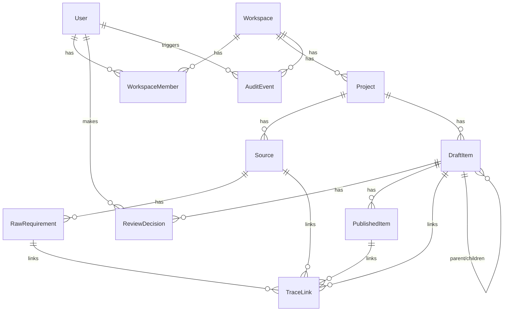

# Architecture Overview

SpecMate is an AI spec layer: it ingests raw requirement sources (documents, transcripts, existing backlogs), uses AI to generate structured epics/stories/tasks/acceptance criteria, and publishes them to Jira/ADO/GitHub with full traceability back to source.

## 1. Project Structure

```
specmate.io/
├── apps/
│   ├── web/                    # Next.js 14+ (App Router) frontend + BFF
│   │   ├── src/app/             # Routes, pages, layouts
│   │   ├── prisma/               # Prisma schema + migrations (source of truth for DB schema)
│   │   └── Dockerfile
│   └── api/                     # FastAPI backend: parsing, AI pipeline, connector sync
│       ├── app/
│       │   ├── routers/          # API endpoints
│       │   ├── services/          # Business logic (parsers, AI adapter, connectors)
│       │   └── core/               # Settings, DB session, logging
│       ├── tests/
│       └── Dockerfile
├── packages/
│   ├── types/                    # Shared TypeScript types (frontend + connector packages)
│   ├── connector-jira/
│   ├── connector-ado/
│   └── connector-github/
├── infra/                        # Bicep IaC for Azure resources (not auto-deployed)
├── .github/workflows/            # CI (lint/typecheck/test) and CD (build/deploy to Azure)
├── CLAUDE.md                     # Agent/contributor guidance
└── architecture.md               # This document
```

## 2. High-Level System Diagram

```
[User] <--> [Next.js Web App (apps/web)] <--> [Azure Postgres]
                    |                                 ^
                    | REST                            |
                    v                                 |
             [FastAPI Backend (apps/api)] ------------+
                    |
                    +--> [Claude API (Anthropic)]  — AI generation pipeline
                    +--> [Jira / ADO / GitHub APIs]  — connectors (ingest + publish)
```

- `apps/web` handles auth, UI, and workspace/project CRUD directly against Postgres via Prisma.
- `apps/api` handles everything CPU/IO-heavy or Python-ecosystem-dependent: document parsing (docx/PDF/Excel/transcripts), the AI generation pipeline, and connector sync jobs. It talks to the _same_ Postgres instance via SQLAlchemy/asyncpg.
- Long-running work (parsing, AI generation, connector sync) is tracked as rows in a Postgres job table (`queued` → `running` → `done`/`failed`) rather than a message broker, keeping infra cost near zero on Azure free credits.

## 3. Core Components

### 3.1. Frontend / BFF — `apps/web`

Description: Primary user interface — workspace/project management, source upload, review/approve/publish workflows for AI-generated items. Also acts as the auth boundary (Auth.js) and the direct Postgres client for CRUD-style reads/writes.

Technologies: Next.js 14+ (App Router), TypeScript, Tailwind CSS, Prisma, Auth.js (NextAuth).

Deployment: Azure Container Apps (Docker image, `output: 'standalone'` build).

### 3.2. Backend — `apps/api`

Description: Handles ingestion parsing (docx/PDF/Excel/CSV/transcripts), the provider-agnostic AI generation adapter (Claude API via the Anthropic SDK), and connector sync jobs (Jira/ADO/GitHub — both reference-data pull and publish).

Technologies: Python, FastAPI, SQLAlchemy/asyncpg, Anthropic SDK.

Deployment: Azure Container Apps (Docker image, internal ingress only — not publicly exposed; called by `apps/web`).

## 4. Data Stores

### 4.1. Primary Database

Name: SpecMate Postgres

Type: Azure Postgres Flexible Server

Purpose: System of record for workspaces, projects, sources, raw requirements, draft items, review decisions, published items, audit events, and trace links. Shared by both `apps/web` (Prisma) and `apps/api` (SQLAlchemy) — the schema itself is the contract between the two services.

**Prisma (`apps/web/prisma/schema.prisma`) owns migrations.** `apps/api/app/models.py` hand-mirrors the same tables via SQLAlchemy for `apps/api`'s reads/writes — there is no cross-language schema sync tool, so changes to `schema.prisma` must be manually reflected in `models.py`.

Tables: `Workspace`, `User`, `WorkspaceMember`, `WorkspaceInvite`, `Project`, `Source`, `RawRequirement`, `DraftItem`, `ReviewDecision`, `PublishedItem`, `AuditEvent`, `TraceLink`, `AiCallLog`.

Soft-delete: soft-deletable models carry a nullable `deletedAt` (active rows have `deletedAt = null`). `ReviewDecision` and `AuditEvent` are immutable logs — no `deletedAt`/`updatedAt` at all; a correction is a new row, not an edit.

`DraftItem` covers all AI-generated item types (epic/story/task/subtask/AC/test/risk/NFR/dependency/assumption/question) via a `type` enum plus a flexible `payload` JSON column for type-specific fields, rather than one wide table of mostly-null columns.

#### Entity relationship diagram



#### Traceability query (Issue #1.3 acceptance criterion)

`TraceLink` carries `sourceId`, `rawRequirementId`, `draftItemId`, and `publishedItemId` (nullable — a trace exists before publish) on a single row, so tracing a `DraftItem` back to its `Source` and forward to its `PublishedItem` is one query, no recursive joins:

```ts
prisma.traceLink.findMany({
  where: { draftItemId },
  include: { source: true, rawRequirement: true, draftItem: true, publishedItem: true },
});
```

## 5. External Integrations / APIs

Service: Anthropic Claude API — AI generation pipeline (extraction, structuring, drafting). Integration: Anthropic SDK (`apps/api/app/services/ai/`), called via a provider-agnostic adapter.

Service: Jira, Azure DevOps, GitHub Issues — read (existing backlog reference data) and write (publish target). Integration: REST APIs, OAuth/API token via connector packages (`packages/connector-*`) and `apps/api` connector services.

### AI pipeline architecture (`apps/api/app/services/ai/`)

- `adapter.py` — the provider-agnostic seam: an `AIAdapter` `Protocol` with a single `generate(request: GenerationRequest) -> GenerationResult` method. Call sites depend only on this interface, never on the Anthropic SDK directly.
- `claude_adapter.py` — `ClaudeAdapter`, the Claude implementation. Uses `output_config: {"format": {"type": "json_schema", "schema": ...}}` on `messages.create()` for server-enforced structured JSON output, and `thinking: {"type": "adaptive"}`. Wraps SDK calls in a typed exception chain (`RateLimitError` → `APIStatusError` → `APIConnectionError`) and re-raises a single `AIGenerationError`.
- `config.py` — `TASK_MODELS`, a small dict mapping task name (`"extraction"`, `"structuring"`, ...) to `{model, effort, max_tokens}`. Swapping which model handles a task is an edit here, not a call-site change.
- `pricing.py` — static Anthropic $/MTok table (input/output/cache-read/cache-write) used to compute `cost_usd` per call.
- `logging_adapter.py` — `LoggingAdapter` wraps any `AIAdapter` and writes one `AiCallLog` row per call (including failed calls, at `costUsd=0`) — kept separate from `ClaudeAdapter` so the provider implementation has no DB dependency.
- `prompts/` — versioned prompt template files (e.g. `extraction_v1.py`) as plain string constants; `GenerationResult.prompt_version` threads the version through to `AiCallLog` for later analysis.
- Default model: `claude-opus-4-8`. Retries: SDK-level `max_retries=3` plus a 60s timeout, configured on the `AsyncAnthropic` client.
- `POST /ai/demo-extract` (`apps/api/app/routers/ai_demo.py`) is a reference/demo route proving the pattern end-to-end — not a product route, superseded once Epic 2/3 add real extraction endpoints.

### Per-customer AI cost tracking (`apps/web/src/lib/ai-cost.ts`)

- `getWorkspaceCostForMonth(workspaceId, year, month)` — sums `AiCallLog` cost/tokens for a workspace within a calendar month via Prisma `aggregate()`.
- `getTopWorkspacesByCost(limit, since?)` — cross-workspace `groupBy` ordered by cost descending, joined to `Workspace.name`/`planRevenueUsd`. Powers the internal dashboard's top-10 view.
- `getCostToRevenueBreaches(thresholdRatio?)` — flags workspaces whose current-month AI cost / `Workspace.planRevenueUsd` exceeds a threshold (env `AI_COST_ALERT_THRESHOLD_RATIO`, default 0.5). Only considers workspaces with a non-null `planRevenueUsd`.
- `Workspace.planRevenueUsd` is a manually-set nullable field — **not a real billing system**. No self-serve UI; set directly via DB access until a real subscription/billing model exists.
- Internal dashboard: `apps/web/src/app/internal/ai-costs/page.tsx`, a Server Component gated by `isInternalAdmin()` (`apps/web/src/lib/admin-access.ts`) — an env-var email allowlist (`INTERNAL_ADMIN_EMAILS`), since there's no platform-staff role in the schema yet (the existing `Role` enum is workspace-scoped: ADMIN/REVIEWER/VIEWER). Unauthorized visitors get `notFound()`, matching the pattern used for workspace-role-gated pages.
- **Alerting is visual-only in this pass.** Cost-to-revenue breaches are surfaced as a warning banner/badge on the dashboard itself — no email/Slack/PagerDuty integration exists yet. Wiring a real notification channel is future work once one is chosen.

### File upload infrastructure (`apps/web/src/lib/blob-storage.ts`, `upload-validation.ts`)

First issue of Epic 2 (Ingestion) — every later file-based parser (docx, PDF, Excel/CSV, transcripts) depends on a `Source` row with a populated `storageKey` pointing at a real stored file.

- **Storage**: Azure Blob Storage (`@azure/storage-blob`), one blob per `Source` at key path `workspaceId/projectId/sourceId/<filename>`, in a `sources` container. `blob-storage.ts` exposes `uploadSourceFile()`, `getDownloadUrl()` (short-lived SAS URL — the container itself is not public), and `deleteSourceFile()`.
- **Ownership**: `apps/web` owns the whole upload flow (`POST /api/workspaces/[workspaceId]/projects/[projectId]/sources`) — validates, uploads to blob, writes the `Source` row via Prisma. `apps/api`'s future parsing jobs consume the file independently via `storageKey`, so this doesn't couple the two services.
- **Validation** (`upload-validation.ts`): a MIME-type allowlist mapped to `SourceKind` (docx/pdf/xlsx/csv/txt), a 25MB size cap (`MAX_UPLOAD_MB` env var), both enforced server-side regardless of the client-side pre-check in the upload UI.
- **Virus scanning is a stub.** `scanFile()` always resolves `CLEAN` — there is no real antivirus integration yet (`Source.scanStatus`: PENDING → CLEAN today; INFECTED is modeled in the schema for when a real scanner, e.g. a ClamAV sidecar or an Azure-native scanning offering, is chosen and wired in).
- **Local dev**: real Azure Storage isn't provisioned yet (see `infra/main.bicep` — Bicep is scaffolded but not deployed). Local/test dev uses the **Azurite** emulator (`docker run -p 10000:10000 mcr.microsoft.com/azure-storage/azurite`); see `infra/README.md`.
- Upload UI: `apps/web/src/components/sources/upload-zone.tsx`, a client component using native HTML5 drag events and `XMLHttpRequest` (not `fetch`) for real upload-progress reporting. Rendered from `apps/web/src/app/workspaces/[workspaceId]/projects/[projectId]/sources/page.tsx`.

### Word document (.docx) parser (`apps/api/app/services/parsing/docx_parser.py`)

First of the file-based parsers (Epic 2) — turns an uploaded `.docx` into `RawRequirement` rows (`{sourceId, sectionPath, order, text}`).

- **Library**: `python-docx` — chosen over `mammoth` for direct structural access (paragraph styles, `document.tables`) needed to build accurate section pointers and preserve table structure, rather than mammoth's HTML-rendering-oriented conversion.
- **Algorithm**: walks `document.element.body.iterchildren()` in true document order (paragraphs and tables are sibling XML elements, not separate collections) so tables are emitted in their actual position. Maintains a heading stack (`Heading 1`/`Heading 2`/... paragraph styles, `Title` counted as level 1) to build a `sectionPath` like `"1. Overview/1.1 Scope"`; falls back to `"p.N"` when there's no heading context yet. Tables are converted to `" | "`-joined row text rather than dropped. Header/footer paragraph text is extracted too, tagged `#header`/`#footer`, but not treated as primary requirement content.
- **Failure handling**: corrupt files, non-docx content, or documents with no extractable text/tables/headers/footers all raise a typed `DocxParseError` with a human-readable message — parsing never silently returns an empty result.
- **Trigger — synchronous, not a job queue.** `POST /sources/{source_id}/parse` (`apps/api/app/routers/sources.py`) is called by `apps/web`'s upload route right after a successful upload (fire-and-forget from the upload response's perspective — a failed trigger call doesn't fail the upload; `Source.status` reflects the real parse outcome). apps/api fetches the file from Blob Storage via `storageKey` (`apps/api/app/services/storage/blob_client.py`, the read-side counterpart to `apps/web`'s `blob-storage.ts`), parses inline, and updates `Source.status` (QUEUED → PARSING → PARSED/FAILED). **This is a deliberate placeholder for the "Postgres job table" pattern described in the Dev commands section below** — no worker/poller exists anywhere in the repo yet; introducing one is follow-up work once parse volume or latency requirements demand async processing, not part of this issue's scope.
- The `ParsedChunk` output type (`{text, section_path, order}`) lives in `apps/api/app/services/parsing/types.py`, shared by every parser rather than owned by docx specifically.
- **Known pre-existing gap fixed alongside this issue**: `apps/api/app/models.py`'s enum-typed columns (`Role`, `SourceKind`, `SourceStatus`, `ScanStatus`, `DraftItemType`, `ReviewDecisionType`, `PublishTarget`) now explicitly declare `Enum(..., name="<PascalCaseName>", create_type=False)` to match the Postgres enum type names Prisma actually created (e.g. `"SourceKind"`) — SQLAlchemy's default lowercase-name inference (`sourcekind`) doesn't match, which nothing caught until this issue's tests were the first to insert a `Source`/`RawRequirement` row via SQLAlchemy instead of only reading.

### PDF parser (`apps/api/app/services/parsing/pdf_parser.py`)

Second file-based parser (Epic 2) — turns an uploaded PDF into `RawRequirement` rows, one chunk per page (PDF's natural structural unit — no heading hierarchy to recover the way docx has).

- **Library**: `pypdf` — pure Python, MIT-licensed, no compiled binary, matching the license-clean bias `python-docx` set. `PyMuPDF`/`fitz` was considered (faster, more accurate, better image-detection) but rejected for its AGPL license. `pdfplumber` is a documented fallback if `pypdf`'s extraction quality proves too lossy in real usage — same `ParsedChunk` interface, a contained swap.
- **Algorithm**: `PdfReader(io.BytesIO(file_bytes))`, iterate pages 1-indexed, `page.extract_text()` per page. Non-empty pages become one `ParsedChunk` each, `sectionPath = "p.N"` (the real page number, not a re-numbered index — a blank page in the middle doesn't shift later page numbers). Blank/whitespace-only pages are skipped without failing the whole document (handles partially-scanned PDFs).
- **Scanned/image-only PDF detection**: if _every_ page has no extractable text, `PdfParseError` is raised with a distinct message ("...appears to be scanned/image-only... text extraction unavailable, OCR not yet supported") rather than silently returning an empty result — this is the acceptance-criterion requirement. A genuinely corrupt/unreadable PDF raises the same error type with a different message, so the two failure modes remain distinguishable in the error string even though both funnel into the same `Source.status = FAILED` + HTTP 422 handling in the router.
- OCR is explicitly out of scope (stretch item per the issue) — a scanned PDF is flagged, not processed.
- Wired into `_PARSERS[SourceKind.PDF]` in `sources.py`, same dispatch pattern the docx parser established — a third/fourth parser (Excel/CSV, transcripts) is expected to add one dict entry each, no router restructuring needed.
- Test fixtures use `reportlab` (dev-only dependency, never in the production image) to generate real multi-page PDFs with actual text content in-memory — mirrors how `python-docx` itself builds the docx test fixtures, since no read-oriented PDF library can also write PDFs.

### Excel/CSV parser (`apps/api/app/services/parsing/spreadsheet_parser.py`)

Row-level extraction for backlog/tracker exports, one `RawRequirement` per non-empty data row.

- **Library**: `openpyxl` (MIT, pure Python) for `.xlsx` — read _and_ write, so tests build real fixtures with the same library; stdlib `csv` for `.csv` (utf-8-sig decode with latin-1 fallback for legacy exports).
- **Pointers use real spreadsheet row numbers** (1-indexed, header row counted): xlsx → `"{sheet}/r.{N}"`, CSV → `"r.{N}"`. Skipped empty rows don't renumber later rows.
- **Header handling**: first row of each sheet/file is assumed to be headers (`has_header=True` — a function parameter, no per-upload override UI yet); data rows render as `"Header: value | Header: value"` pairs so column semantics survive into the extracted text. Cells beyond the header width keep their value un-labelled.
- **Messy-export tolerance**: merged cells (value in anchor cell only), inconsistent column counts, and empty rows all degrade gracefully — never a crash. Corrupt files or workbooks with zero extractable rows raise `SpreadsheetParseError`.

### Plain text / transcript parser (`apps/api/app/services/parsing/text_parser.py`)

Stdlib-only. Two auto-detected modes:

- **Transcript mode** — when ≥3 non-blank lines _and_ ≥25% of them start with a timestamp (`[00:31:12]`, `(31:12)`, `00:31:12 —`, `MM:SS`-style), chunks are the text between timestamps; each chunk's pointer is its nearest preceding timestamp. Continuation lines without a timestamp fold into the preceding chunk (preserves multi-line speaker turns).
- **Paragraph mode** (fallback) — blank-line-separated paragraphs with `p.N` pointers, matching the docx parser's no-heading fallback convention. The threshold rule prevents prose that mentions a time once from being misdetected as a transcript.
- Chunk boundaries are always logical (timestamp or paragraph break) — sentences are never split mid-way. Wired for both `SourceKind.TXT` and `SourceKind.TRANSCRIPT` (the latter isn't reachable via upload MIME detection yet; it exists for future connector-sourced transcripts).

### Connectors (`apps/api/app/services/connectors/`, Issues #12-16)

Two connector families share `apps/api/app/routers/connectors.py`, and all remote fetchers are injected via the overridable `get_connector_fetchers` dependency (tests fake the network boundary, same pattern as the blob downloader):

- **Backlog reference sync (Jira / ADO / GitHub)** — `POST /connectors/{jira|ado|github}/reference-items/sync` with `{project_id, remote}` (Jira project key / ADO project name / GitHub `owner/repo`). Fetchers normalize remote items into `ReferenceItemData` (Jira ADF descriptions flattened to text; ADO HTML stripped; GitHub PRs filtered out of the issues endpoint, labels become `itemType`) and the router **upserts `ReferenceItem` rows by `(projectId, tool, externalKey)`** — re-sync updates in place, never duplicates. These are read-only reference data for duplicate detection (Issue 3.5, which owns the actual semantic indexing — the stored text here is its prerequisite); they're rendered with a READ-ONLY badge in the source management UI.
- **Content sync (Confluence page / Slack channel)** — `POST /connectors/confluence/pages/{id}/sync` and `POST /connectors/slack/channels/{id}/sync`. Content becomes a `Source` (kind CONFLUENCE/SLACK, no blob) **upserted by `(projectId, externalRef)`** with its `RawRequirement`s replaced on every sync — re-sync updates the same Source. Confluence storage-format HTML is walked with a stdlib `HTMLParser` tracking the h1-h6 hierarchy for `{pageTitle}/{heading}` pointers; Slack messages are filtered (bot messages, any-subtype system messages, and empty/reactions-only messages excluded) and chunked one-per-message with `#{channel}@{timestamp}` pointers and `{author}: {text}` bodies.
- **Auth is single-tenant and ops-configured via env** (`ATLASSIAN_EMAIL`/`ATLASSIAN_API_TOKEN` shared by Jira+Confluence, `ADO_ORG_URL`/`ADO_PAT`, `GITHUB_TOKEN`, `SLACK_BOT_TOKEN`) — a per-workspace connection store, OAuth flows, and browse/pickers (Confluence spaces, Slack channels) are deferred; content is synced by ID. Teams (vs Slack) was not built for v1.

### Ingestion pipeline (Issue #17)

The parse flow shared by all file parsers (`_parse_one` in `apps/api/app/routers/sources.py`):

- **Within-source dedup** (`app/services/parsing/dedupe.py`) — chunks identical after casefold+whitespace normalization are dropped (first occurrence kept, `order` renumbered) before persisting, so repeated boilerplate (headers/footers/disclaimers) doesn't become duplicate RawRequirements. Cross-source semantic dedup belongs to Issue 3.5.
- **Failure recording** — a failed parse stores its human-readable message on `Source.parseError` (cleared on success), so the UI shows actionable errors, not just a transient HTTP response.
- `GET /projects/{id}/ingestion-summary` — source count, per-status breakdown, fragment totals, per-source rows, last-updated; the source management UI's summary numbers come from the same tables.
- `POST /projects/{id}/reparse` — re-runs the pipeline over every parseable file-backed Source in a project; per-source failures are reported in the response, not fatal to the batch.

### Source management UI (Issue #18, `apps/web/.../projects/[projectId]/sources/page.tsx`)

- Server component renders the persisted source list (name, kind, fragment count, live status badge) plus a summary bar (total sources / fragments extracted / last updated) and the read-only reference-item list.
- FAILED sources show their stored `parseError` inline — actionable, not generic.
- **Re-parse** goes through an auth-gated web API proxy (`POST .../sources/{id}/reparse` → `apps/api`'s parse endpoint) since `apps/api` has internal-only ingress in Azure — the browser never calls it directly.
- **Delete is a soft-delete**: `deletedAt` stamped on the Source and its RawRequirements (rows preserved for trace/audit history), plus an `AuditEvent` (`source.deleted`) recording the actor.

### AI generation engine (Epic 3, `apps/api/app/services/generation/`)

- **Pipeline** (`pipeline.py`, `POST /projects/{id}/generate`): four AI passes through the provider-agnostic adapter — cluster fragments → epics → stories+tasks (hierarchy inferred here; orphans stay unparented rather than forced, Issue 3.7) → supporting items (AC/tests/risks/NFRs/dependencies/assumptions/questions, only where traceable) — then a scoring pass (0-100 sub-scores for completeness/clarity/testability/specificity + human rationale, Issue 3.4). Gap detection (Issue 3.6): low completeness/specificity plus a model-produced _specific answerable question_ sets `flags.gap`. **Idempotency**: a `GenerationRun` row keyed on (projectId, sha256 of fragment texts) — re-running unchanged content reuses the run.
- **Schemas** (`schemas.py`, Issue 3.2): canonical JSON Schemas enforced via structured output on every call; `packages/types/src/draft-items.ts` hand-mirrors the shapes for rendering. Structured-output constraints discovered live: no `additionalProperties: true`, no type unions with enums, no integer `minimum`/`maximum` — optionality is expressed by omission/empty string.
- **Traceability** (Issue 3.3): passes cite fragment ids; persisted as `TraceLink` rows. Uncited items get `flags.noTrace` — flagged anomalies, never silent.
- **Duplicate detection** (`similarity.py`, Issue 3.5): pure-Python TF-cosine over title+description against `ReferenceItem`s (Anthropic has no embeddings API; a separate embedding provider is a deliberate non-dependency for now — documented upgrade path). Threshold: `Workspace.duplicateThreshold`, falling back to `DUPLICATE_SIMILARITY_THRESHOLD` (0.55).
- **Regeneration** (Issue 3.9, `POST /draft-items/{id}/regenerate`): reviewer context folded into a revision — new row with `revisionOfId`, original preserved (soft-deleted out of the queue), TraceLinks carried over. Approved items are locked (409).
- **Stats** (Issue 3.10, `GET /projects/{id}/generation-summary`): run stats + live recomputed counts incl. source coverage (fragments cited by ≥1 item).

### Human review workflow (Epic 4, `apps/web/src/lib/review.ts` + `/review` UI)

- **Decisions** (Issue 4.4): approve / reject (reason required) / edit / reopen via `applyDecision` — every decision writes an attributed `ReviewDecision` + `AuditEvent`; nothing anonymous. Approve locks regeneration.
- **Diff tracking** (Issue 4.3): `DraftItem.originalDraft` is the immutable AI draft; `editHistory` accumulates structured field-level diffs (sequence, not first-vs-last). Review UI has a "show AI draft" toggle.
- **Duplicate resolution** (Issue 4.5): side-by-side generated vs. matched reference item; confirm (reject linked to the existing key) / merge (rejects + `duplicate.merged` audit carrying the content — external write-back belongs to Epics 5-7) / override (clears the flag with a distinct `duplicate.overridden` audit action, queryable for false-positive monitoring).
- **Gap resolution** (Issue 4.6): answer-and-regenerate (through the web proxy to apps/api, `gap.regenerated` audit) or manual resolve (`gap.resolved_manually`). Gap-flagged items **cannot be approved** until resolved (server-side 409).
- **Approval gates** (Issue 4.7, scoped): `Workspace.approvalStages` 1 (default) or 2 — stage 2 is an ADMIN sign-off (`signedOffByUserId`), enforced server-side (`isPublishable`); premature/wrong-role sign-off rejected at the API. Fully configurable named stages are deferred.
- **Activity feed** (Issue 4.8): server-rendered straight from `AuditEvent` (can't drift from the audit trail), client polls `router.refresh()` every 5s; actor/action filters.
- **Bulk ops** (Issue 4.9): bulk approve/reject loop the same `applyDecision` path — identical per-item audit granularity; confirm dialog in the UI.

### Jira publishing (Epic 5, `apps/api/app/services/connectors/jira_auth.py` + `jira_publish.py`)

- **Connection abstraction** (Issues 5.1/5.8): call sites depend on the `JiraConnection` protocol, not a concrete auth. `CloudTokenConnection` (Atlassian email+API token, env-configured single-tenant) is the one connection object shared by the read-only backlog sync (Issue 2.8) and publishing. OAuth 2.0 3LO and a per-workspace encrypted connection store are deferred (needs an Atlassian app registration); Server/DC differences (REST v2, no ADF, PAT/Bearer, epic-link vs parent field) are documented in `jira_auth.py` for the future implementation. Health check: `GET /connectors/jira/health` (drives the UI's reconnect prompt).
- **Discovery** (Issue 5.2): `GET /connectors/jira/projects` + per-project issue types/fields (required flagged) via the v3 createmeta endpoints — the customer's real configuration, cached as a snapshot on `PublishMapping.metadata` and refreshed whenever the mapping is saved.
- **Mapping** (Issue 5.3): `PublishMapping` per (project, tool) — SpecMate type → Jira issue type map (defaults auto-suggested from discovery by name matching), plus `fieldDefaults` fixed values for required Jira fields SpecMate can't populate naturally. Admin UI at `/settings/publishing` with per-type dropdowns from the discovered set and required-field warnings.
- **Publish** (Issues 5.4/5.6): `POST /projects/{id}/publish/jira {item_ids}` — per-item validation (approved + signed-off when two-stage, mapped type exists, required fields covered — fail-fast before any API call), hierarchy-ordered creation (epics → stories → tasks → subtasks), children linked via the modern unified `parent` field with keys minted earlier in the same batch; a child whose parent isn't published is **blocked with a clear message**, never orphaned. Re-publish of an already-published item is blocked, never duplicated.
- **Write-back** (Issue 5.5): success creates a `PublishedItem` (key, permalink) and stamps `TraceLink.publishedItemId` — the trace is queryable both directions; the review UI shows a clickable `KEY ↗` chip.
- **Errors/retry** (Issue 5.7): 429 (honoring Retry-After) and 5xx retried with backoff (4 attempts); 4xx surfaced immediately with Jira's own field errors; per-item failures persisted on `flags.publishError` (refresh-safe) and individually retriable; batch successes never rolled back by sibling failures.

### Azure DevOps publishing (Epic 6, `apps/api/app/services/connectors/ado_auth.py` + `ado_publish.py`)

Mirrors the Jira publishing architecture (connection abstraction → discovery → mapping → hierarchy-ordered idempotent publish → write-back → retry), same gateway-dependency-injection pattern for tests.

- **Connection abstraction** (Issues 6.1/6.8): call sites depend on the `AdoConnection` protocol. Two implementations: `PatConnection` (Basic auth, empty username + PAT, env-configured single-tenant, shared with the read-only backlog sync from Issue 2.9) and `OAuthConnection` (app-only OAuth via the Microsoft identity platform — client-credentials grant against an Azure AD app registration, `AZURE_AD_CLIENT_ID`/`SECRET`/`TENANT_ID`, requesting the ADO resource scope `499b84ac-1321-427f-aa17-267ca6975798/.default`; the service principal must be a member of the ADO org and the app must have admin-consented "Azure DevOps" API permission). `get_ado_connection()` prefers OAuth when all three Azure AD settings are present, else falls back to PAT. `_OAuthBearerAuth` fetches and caches the bearer token, refreshing ~60s before expiry. Health check: `GET /connectors/ado/health`. Azure DevOps _Server_ (on-prem) differences are documented in `ado_auth.py` for a future Issue 6.8 implementation.
- **Discovery** (Issue 6.2): `GET /connectors/ado/projects` + per-project work item types with genuinely required fields (via the `alwaysRequired` field flag — excludes the dozens of system-managed fields like IterationLevel1-7) and area/iteration paths (fetched as a tree via `classificationnodes` and flattened into `"Root\Child"` path strings), cached on `PublishMapping.metadata`.
- **Mapping** (Issue 6.3): `PublishMapping` per (project, `ADO`) — SpecMate type → work item type map, `fieldDefaults` for required fields SpecMate doesn't populate naturally (e.g. `Microsoft.VSTS.Common.Priority` for Epics), default area/iteration path. Admin UI at `/settings/publishing-ado`.
- **Publish** (Issue 6.4): `POST /projects/{id}/publish/ado {item_ids}` — same fail-fast-validation / hierarchy-ordering / idempotent-republish-blocking pattern as Jira. Work items are created via the JSON Patch API (`POST .../_apis/wit/workitems/${type}`, `application/json-patch+json` body of `{op: "add", path: "/fields/...", value}` operations); parent-child hierarchy uses a `System.LinkTypes.Hierarchy-Reverse` relation pointing at the parent's `_apis/wit/workItems/{id}` URL.
- **Write-back / errors**: same `PublishedItem` + `TraceLink` write-back and 429/5xx-retried-with-backoff pattern as Jira.
- **Live-verified** against a real ADO org (`dev.azure.com/hiteshngtl`, project `hitesh-specmate`): Epic + Story published with correct bidirectional hierarchy link, required-field validation correctly blocked an Epic missing `Priority` until a fixed default was configured.

### GitHub Issues publishing (Epic 7, `apps/api/app/services/connectors/github_auth.py` + `github_publish.py`)

- **Connection abstraction** (Issues 7.1/7.8): `GitHubConnection` protocol, `TokenConnection` (PAT/fine-grained token, `GITHUB_TOKEN`, parameterized base URL for future GitHub Enterprise Server support). Health check: `GET /connectors/github/publish-health`.
- **Discovery** (Issue 7.2): `GET /connectors/github/repos` (filtered to repos where the token has push access), plus per-repo labels, milestones, and a best-effort file tree (`git/trees/{branch}?recursive=1`, capped at 500 paths) used for Coding Agent mode file-reference suggestions — deliberately simple keyword matching against real paths, never fabricated.
- **No native hierarchy**: GitHub Issues has no parent/child concept. SpecMate item types map to `specmate:{type}` labels rather than a distinct issue type; parent-child hierarchy is represented as a `## Child items` task-list section appended to the parent issue's body, backfilled via a `PATCH` after each child in the batch publishes (best-effort — a backfill failure doesn't fail the batch).
- **Ticket format mode** (Issue 7.3, `format_adapter.py`): `PublishMapping.formatMode` (`HUMAN` | `CODING_AGENT` | `BOTH`, default `HUMAN`). `HUMAN` produces prose descriptions; `CODING_AGENT` produces structured markdown (`## Scope`, `## Acceptance Criteria` as a checklist, `## Referenced files/modules`, `## Definition of Done`). Discovery always returns `suggested_format_mode: CODING_AGENT` for GitHub (suggested, never forced — Human stays the default until validated with users). `BOTH` is schema-ready but raises on format (deliberately unimplemented).
- **Publish** (Issue 7.4): `POST /projects/{id}/publish/github {item_ids}` — same fail-fast/hierarchy-ordering/idempotent pattern. Rate-limit detection covers both HTTP 429 and GitHub's HTTP 403 + `X-RateLimit-Remaining: 0` (or "rate limit" body text) signal.
- **Live-verified** against a real repo (`hiteshiat1/specmate-test-repo`): Epic + Story published as issues #1/#2, task-list backfill on the parent confirmed (`## Child items` checkbox linking to the child issue), Coding Agent formatting confirmed, re-publish of the same item correctly blocked (`"Already published as #1."`) with no duplicate created.

### Audit trail & traceability (Epic 8)

- **Immutable audit event log** (Issue 8.1): `AuditEvent` carries `workspaceId`, `projectId`, `actorUserId`, `actorType` (`USER` = human action, `SYSTEM` = automated pipeline e.g. parsing, `AI` = model-generated e.g. generation runs), `action`, `entityType`/`entityId`, structured `beforeState`/`afterState` JSON, `metadata`. **DB-level immutability**: a Postgres trigger (migration `add_audit_immutability_and_snapshots`) rejects UPDATE/DELETE for every role including admins; the only escape hatch is the `specmate.maintenance` session GUC, reserved for test-DB cleanup and future retention jobs — application code never sets it. Note: `actorUserId` is `ON DELETE SET NULL`, so deleting a User implicitly UPDATEs audit rows and is likewise blocked — user deletion (not implemented anywhere yet) would require a maintenance-mode migration. **Transactional linkage**: writes go through `apps/api/app/services/audit.py::record_audit_event` (adds to the caller's session, never commits) or inline in the same `prisma.$transaction` on the web side — a failed audit write rolls back the action it describes. **Coverage**: parse success/failure (SYSTEM), generation run + regeneration (AI), publish success/failure ×3 tools (USER — the web proxies forward the authenticated session's user id as `actor_user_id`; it is never taken from the client body), approve/reject/edit/sign-off/reopen/duplicate/gap resolution (USER, from Epic 4), snapshot creation.
- **Full trace chain** (Issue 8.2, `apps/web/src/lib/trace.ts`): `traceByExternalKey(workspaceId, key)` resolves external key → PublishedItem → DraftItem (incl. the `revisionOfId` regeneration chain) → ReviewDecisions (with actor) → TraceLinks → RawRequirements (with `sectionPath` location pointers) → Sources, in one call; `traceBySource(workspaceId, sourceId)` is the reverse (every item + external key a source fed, superseded revisions excluded); `traceByItem` powers the review-queue trace panel. Served via `GET /api/workspaces/{ws}/trace?key=|item=|source=`.
- **Audit trail UI** (Issue 8.3): `/workspaces/{ws}/projects/{p}/audit` — timeline over AuditEvent filtered by action/actor/date-range, with an external-key search box that renders the full chain (key → item → decisions → source citations). The review queue's expanded item has a "View full trace" toggle rendering the chain inline (no navigation). The Epic 4 activity feed (`/review/activity`) continues to read from the same log.
- **Snapshot export** (Issue 8.4): `Snapshot` table (immutable — UPDATE rejected by trigger; no `updatedAt`/`deletedAt`). `POST /projects/{id}/snapshots` assembles the full trace map (`app/services/reports/trace_map.py`) — every active item with decisions, published keys, citations — and stores it as JSON; **the stored JSON is the artifact**. `GET .../snapshots/{id}/pdf` renders (reportlab, `app/services/reports/pdf.py`) from the stored JSON, never live tables, so an exported snapshot stays accurate after later edits/re-publishes (covered by a test that edits an item post-snapshot and asserts the artifact is unchanged). Web UI at `/exports`.
- **Approval report** (Issue 8.5): `GET /projects/{id}/approval-report[/pdf]?date_from&date_to` — approved items only, each row = title/type/approver/timestamp/source citation/published keys; date-range-scopable; PDF has a workspace-branding placeholder header. Live (non-snapshot) query by design — it reflects current state at generation time.
- **Traceability matrix data readiness** (Issue 8.6, review only): confirmed the existing schema answers "which requirements have zero associated test coverage" with no data-model change — TraceLinks are created for every generated item type including `TEST` (pipeline.py links all drafts to their cited fragments), so `RawRequirement`s lacking a TraceLink to a non-deleted `TEST`-type DraftItem are exactly the uncovered requirements (verified live: 5 covered / 52 uncovered on the dev DB). No gap found; the Act Two matrix UI/export remains future work by design.

### Onboarding flow (Issue 10.10)

Before this, there was no path from signup to a usable project: no project-creation UI/API, no "Generate" trigger anywhere in the product, and the signup form dead-ended on a static "WORKSPACE CREATED" screen with nowhere to go next.

- **Workspace dashboard** (`/workspaces/{ws}`): lists projects with source/item counts; empty state (a brand-new workspace) _is_ the entry point into the guided wizard — creating the first project routes straight into it rather than a plain project page.
- **Project creation**: `POST /api/workspaces/{ws}/projects` (new; previously projects only existed via seed scripts), `components/workspace/new-project-form.tsx`.
- **Generate trigger**: `POST /api/workspaces/{ws}/projects/{p}/generate` proxies to the existing `apps/api` generation endpoint (Epic 3) — the first web-side caller of it; no UI triggered generation before this issue.
- **Guided wizard** (`/workspaces/{ws}/projects/{p}/get-started`, `components/onboarding/onboarding-wizard.tsx`): three-step indicator — connect a tool (optional; deep-links to the Epic 5/6/7 mapping settings pages, skippable since generation only needs a source) → upload a source (reuses `UploadZone`, polls the new `GET .../sources/{id}` status endpoint until parsed) → generate (calls the trigger above, then routes into `/review`). Sensible defaults mean no field-mapping decisions block a first run (10.10 AC).
- **Time-to-first-value instrumentation**: `Workspace.firstGenerationAt`, stamped once — by `run_generation()` — the first time a workspace's generation run completes; `createdAt` is the signup moment, so the delta is the workspace's actual time-to-value. Internal dashboard at `/internal/time-to-value` (same `isInternalAdmin` staff-allowlist gate as the pre-existing AI cost dashboard) shows per-workspace time and a reached-target/median summary against the 15-minute target.
- **Signup flow fix**: `/api/signup` now returns the created `workspaceId`; the onboarding form redirects into the dashboard instead of stopping at a dead-end confirmation screen.
- Not live-verified against the real Claude API end-to-end: the `scoring` pipeline stage was timing out against the live Anthropic API at verification time (pre-existing, unrelated to this change — reproduced on both a large and a minimal test project). The `firstGenerationAt` stamping logic itself is covered by a deterministic test (`test_first_generation_stamps_workspace_time_to_value_once`, using the existing `FakeAdapter`, no network dependency).

### Pricing & billing (Issue 10.9)

Hybrid model: a flat base subscription plus metered usage tied to the value moment (published items). **⚠️ Placeholder pricing** — `apps/web/src/lib/pricing.ts` has clearly-marked fake numbers (`PLACEHOLDER_PRICING = true`); no real price points were decided by the business as of this writing. **Real payment processing was not exercised** — there is no Stripe account for this project yet, so everything below is built and unit-tested against Stripe's API shape but has never been run against a live (even test-mode) Stripe account.

- **Schema**: `Workspace.pricingTier` (`STARTER` | `ENTERPRISE`), `subscriptionStatus` (mirrors Stripe subscription status), `stripeCustomerId`/`stripeSubscriptionId` (unique), `subscriptionBaseUsd` (read from the real Stripe subscription once active — not hand-entered). New `UsagePeriod` table: one row per workspace per UTC calendar-month period, `publishedItemCount` (computed) + `reportedCount`/`reportedToStripeAt` (how much of that has been pushed to Stripe so far — Stripe meter events are additive, so only the delta is ever reported). `Workspace.planRevenueUsd` (Issue 1.6's manual placeholder) is kept as the fallback for ENTERPRISE workspaces not run through Stripe at all.
- **Tier selection** (10.9 AC 1): a plan-selection step in the onboarding form (`apps/web/src/app/onboarding/onboarding-form.tsx`) after workspace creation. STARTER → Stripe Checkout (`POST /api/workspaces/{ws}/billing/checkout`, subscription mode, base Price + metered overage Price as two line items). ENTERPRISE → `POST /api/workspaces/{ws}/billing/tier`, no Stripe object created at all (sales-assisted, custom pricing negotiated outside self-serve billing). Skippable — a workspace can decide later.
- **Webhook** (`POST /api/stripe/webhook`, `apps/web/src/lib/stripe.ts`): the only trusted path for subscription state changes — the app never assumes a subscription is active just because Checkout redirected successfully. Verifies Stripe's signature (`stripe.webhooks.constructEvent`) before touching anything; rejects unsigned/invalid requests with 503/400. Handles `checkout.session.completed` (activates), `customer.subscription.{created,updated}` (syncs status + real base price), `customer.subscription.deleted` (cancels). Tested with `Stripe.webhooks.generateTestHeaderString` to produce validly-signed fixtures — including a rejected-invalid-signature case.
- **Usage metering** (10.9 AC 2, `apps/api/app/services/billing/metering.py`): counts `PublishedItem` rows per workspace within a UTC calendar-month window (joined `PublishedItem → DraftItem → Project` to reach `workspaceId`, since `PublishedItem` doesn't carry it directly), upserted into `UsagePeriod` — idempotent per `(workspaceId, periodStart)`, safe to re-run. `POST /billing/meter-usage` meters every workspace for the current period; no real job scheduler exists yet (same synchronous-on-demand posture as parsing/generation — see the roadmap note below), so this needs an external cron once one exists.
- **Stripe usage reporting** (`apps/api/app/services/billing/stripe_reporting.py`): uses the current Stripe **Billing Meter Events API** (`client.v1.billing.meter_events.create`) — the modern mechanism, superseding the older `usage_records.create` endpoint. Reports only the delta since the period's last report (meter events are additive), with a deterministic `identifier` (`{usagePeriodId}:{count}`) so a retried report can't double-count. Requires a Stripe Meter configured with `event_name` matching `STRIPE_USAGE_EVENT_NAME`. Raises rather than silently skipping if Stripe isn't configured — the `/billing/meter-usage` endpoint catches that and reports `stripe_reporting_skipped: true` so metering still runs (and stays useful for the margin dashboard below) even with no Stripe account.
- **Margin flagging** (10.9 AC 3, `apps/web/src/lib/margin.ts`): extends the Issue 1.6 AI-cost dashboard. For STARTER workspaces, "effective revenue" is computed from the real pricing formula applied to real metered usage (`estimateStarterMonthlyUsd(publishedItemCount)`), not a hand-entered number. For ENTERPRISE, uses the real Stripe `subscriptionBaseUsd` if a subscription exists, else falls back to the manual `planRevenueUsd`. Surfaced as a new "Margin by pricing tier" section on `/internal/ai-costs`, flagging workspaces whose AI cost exceeds `AI_COST_ALERT_THRESHOLD_RATIO` (same env var/default as the existing cost-to-revenue breach check) of their tier-derived effective revenue.
- **Not built**: real Stripe account/keys (none exist for this project — everything above is test-mode-only code, unverified against a live account), a job scheduler for periodic metering (manual/cron-triggered for now), marketplace-native billing for Atlassian/GitHub/ADO listings (Issues 10.2–10.4, deferred).

## 6. Deployment & Infrastructure

Cloud Provider: Azure (using free credits)

Key Services Used: Azure Container Apps (web + api), Azure Postgres Flexible Server, Azure Container Registry, Azure Key Vault, Azure Blob Storage (uploaded Source files), Log Analytics.

CI/CD Pipeline: GitHub Actions. `ci.yml` runs lint/typecheck/test on every PR. `deploy.yml` builds and pushes Docker images on merge to `main`, deploys to staging automatically, and deploys to production behind a manual approval gate (GitHub Environments). Auth to Azure uses OIDC federated credentials bound to a user-assigned Managed Identity — no long-lived client secret stored in GitHub.

Monitoring & Logging: Azure Log Analytics (Container Apps log destination).

## 7. Security Considerations

Authentication: Auth.js (NextAuth), self-hosted.

Authorization: Workspace-scoped RBAC — `Admin`, `Reviewer`, `Viewer` roles (see Issue #2).

Data Encryption: TLS in transit (Container Apps ingress, Postgres SSL); Azure-managed encryption at rest for Postgres and Key Vault.

Key Security Tools/Practices: Secrets in Azure Key Vault / Container App settings only, never in code or git (`.env*` gitignored repo-wide). No long-lived Azure credentials in GitHub — OIDC federated identity only. Row-level workspace data isolation enforced at the query layer.

## 8. Development & Testing Environment

Local Setup Instructions: See [README.md](README.md).

Testing Frameworks: Vitest (`apps/web`, `packages/*`), pytest (`apps/api`).

Code Quality Tools: ESLint + Prettier + Husky/lint-staged (TypeScript side), Ruff + mypy (Python side).

## 9. Future Considerations / Roadmap

- ~~Full data model implementation (Issue #3)~~ — done
- ~~Auth/multi-tenancy implementation (Issue #2)~~ — done
- ~~AI pipeline adapter implementation (Issue #4)~~ — done (`apps/api/app/services/ai/`); real extraction/structuring logic still belongs to Epic 2/3
- ~~Per-customer AI cost tracking (Issue #6)~~ — done: query layer, top-10 dashboard, and visual cost/revenue breach warnings exist; real notification delivery (email/Slack/PagerDuty) and a real billing/subscription model are still open
- ~~File upload infrastructure (Issue #7)~~ — done: drag-and-drop UI, type/size validation, Azure Blob Storage, `Source` row creation; virus scanning is a stub (always CLEAN) and the Storage Account isn't provisioned yet (Bicep scaffolded only)
- ~~Word document (.docx) parser (Issue #8)~~ — done: `python-docx`-based parsing into `RawRequirement` rows with nested `sectionPath`, table/header/footer extraction, typed `DocxParseError` on failure; triggered via a synchronous `POST /sources/{id}/parse` (placeholder for a real job-table/worker model — see below)
- ~~PDF parser (Issue #9)~~ — done: `pypdf`-based per-page extraction with `p.N` page-number pointers, typed `PdfParseError` for corrupt files and scanned/image-only detection (no silent empty result); OCR fallback for scanned PDFs is explicitly out of scope (stretch item)
- ~~Excel/CSV parser (Issue #10)~~ — done: `openpyxl` + stdlib `csv`, row-level extraction with real `{sheet}/r.{N}` pointers, header-pair rendering, messy-export tolerance
- ~~Plain text / transcript parser (Issue #11)~~ — done: stdlib-only, timestamp-aware transcript chunking with paragraph-mode fallback
- ~~Connectors (Issues #12–16)~~ — done at the sync-endpoint level: Confluence page + Slack channel content sync (Source upsert by `externalRef`), Jira/ADO/GitHub read-only backlog pull into `ReferenceItem` (upsert, no duplicates). Deferred: OAuth flows + per-workspace connection store (auth is env-var single-tenant), Confluence/Slack browse pickers, Teams support, semantic indexing (Issue 3.5)
- ~~Raw requirement extraction pipeline (Issue #17)~~ — done: within-source dedup, `Source.parseError` recording, ingestion-summary + reparse-all endpoints
- ~~AI generation engine (Epic 3, Issues #19-28)~~ — done: 4-pass pipeline, strict schemas, traceability, scoring+gaps, TF-cosine duplicate detection (embedding index deferred), regeneration revisions, stats; verified end-to-end with real Claude API calls
- ~~Human review workflow (Epic 4, Issues #29-37)~~ — done: review queue UI, decisions with audit, diff tracking, duplicate/gap resolution flows, 2-stage approval gates (named-stage config deferred), polling activity feed, bulk ops
- ~~Jira publishing (Epic 5, Issues #38-45)~~ — done: connection abstraction + health, real-config discovery, mapping UI with fixed defaults, hierarchy-aware idempotent publish with retry and per-item results, bidirectional trace write-back; OAuth 3LO + per-workspace connection store deferred (needs Atlassian app registration)
- ~~Azure DevOps publishing (Epic 6, Issues #46-53)~~ — done: connection abstraction (PAT + app-only OAuth via Azure AD app registration), real-config discovery (work item types, genuinely-required fields, area/iteration paths), mapping UI, JSON-Patch-based hierarchy-aware idempotent publish with native parent links, bidirectional trace write-back; live-verified against a real ADO org. Per-workspace connection store still deferred (single-tenant env config, same as Jira/GitHub); OAuth is app-only, not per-user delegated auth
- ~~GitHub Issues publishing (Epic 7, Issues #54-61)~~ — done: connection abstraction + health, discovery (labels/milestones/file tree), Human vs Coding Agent ticket format modes (`BOTH` deferred), label-based type mapping + task-list-based hierarchy backfill (GitHub Issues has no native hierarchy), idempotent publish with retry; live-verified against a real repo including task-list backfill and idempotent re-publish blocking
- ~~Audit trail & traceability (Epic 8, Issues #62-67)~~ — done: trigger-enforced append-only AuditEvent with actorType + before/after states and full ingest/generate/review/publish coverage, bidirectional trace-chain queries + audit UI with external-key search + inline item trace panel, immutable JSON+PDF snapshot exports, date-scoped approval report PDF, traceability-matrix data-readiness confirmed (no schema gap). Deferred by design: Act Two matrix UI/export; real notification/branding polish on report PDFs
- ~~Source management UI (Issue #18)~~ — done: persisted source list with status badges + actionable errors, re-parse via web proxy, soft-delete with audit trail, read-only reference-item list, summary bar
- ~~Onboarding flow (Issue 10.10)~~ — done: workspace dashboard + project creation (previously nonexistent), generate-trigger proxy (previously nonexistent), guided 3-step wizard (connect tool [optional] → upload → generate → review) with sensible defaults, `Workspace.firstGenerationAt` time-to-value instrumentation + internal dashboard, signup dead-end fixed. Not live-verified end-to-end against the real Claude API (unrelated pre-existing `scoring`-stage timeout at verification time); the time-to-value stamping itself is covered by a deterministic (FakeAdapter) test.
- ~~Pricing & packaging (Issue 10.9)~~ — done: STARTER (self-serve, Stripe Checkout subscription + metered per-published-item overage via the Billing Meter Events API) / ENTERPRISE (sales-assisted, no Stripe object) tier selection at onboarding; signature-verified Stripe webhook syncing subscription state; idempotent usage metering (`UsagePeriod`, one row per workspace per UTC month) + delta-based Stripe usage reporting; margin-flagging dashboard extension using real tier-derived revenue instead of only the manual `planRevenueUsd` fallback. **Placeholder pricing** (no real price points decided) and **no real Stripe account exists yet** — all of this is built and tested against Stripe's API shape (incl. signature verification with `generateTestHeaderString`) but has never run against a live test-mode Stripe account. Deferred: marketplace-native billing (Issues 10.2–10.4), a real job scheduler for periodic metering.
- If job volume grows beyond what a synchronous per-request parse comfortably handles, revisit introducing a real Postgres job table + worker (or Azure Service Bus / Storage Queue) — nothing like that exists yet as of Issue #9.

## 10. Project Identification

Project Name: SpecMate

Repository URL: https://github.com/nexgen-tech-labs/specmate.io

Primary Contact/Team: nexgen-tech-labs

Date of Last Update: 2026-07-07

## 11. Glossary / Acronyms

RawRequirement: An extracted fragment of text from an ingested source, with a location pointer (page, section, timestamp, row) back to that source.

DraftItem: An AI-generated item (epic/story/task/subtask/AC/test/risk/NFR/dependency/assumption/question) awaiting human review.

PublishedItem: A DraftItem that has been approved and pushed to an external tool (Jira/ADO/GitHub), recording the target tool, external key, and permalink.

TraceLink: The join record connecting a Source through RawRequirement to DraftItem to PublishedItem, enabling full traceability in either direction.
