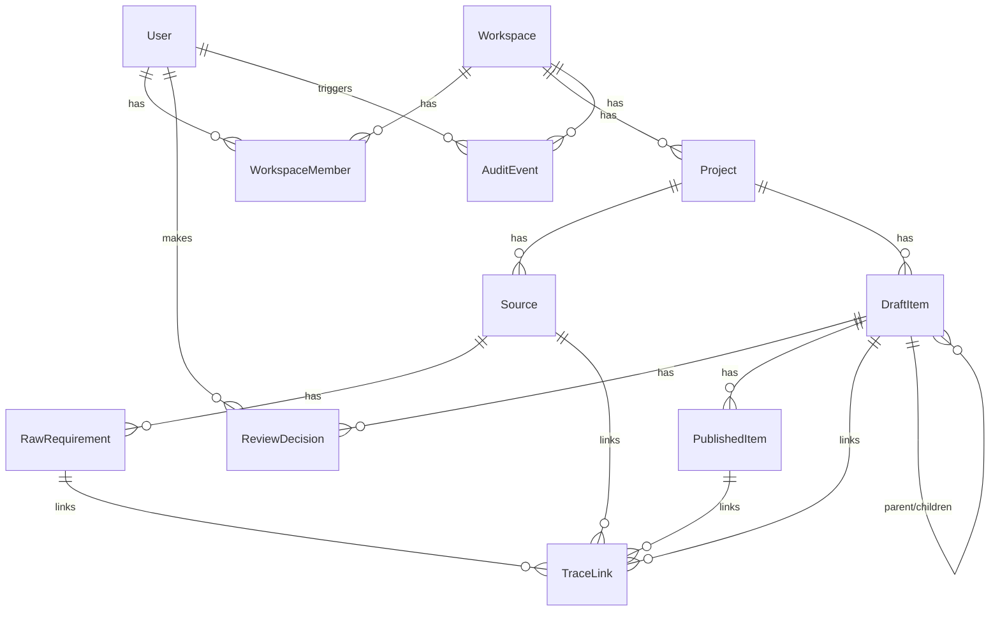

# Architecture Overview

SpecMate is an AI spec layer: it ingests raw requirement sources (documents, transcripts, existing backlogs), uses AI to generate structured epics/stories/tasks/acceptance criteria, and publishes them to Jira/ADO/GitHub with full traceability back to source.

## 1. Project Structure

```
specmate.io/
├── apps/
│   ├── web/                    # Next.js 14+ (App Router) frontend + BFF
│   │   ├── src/app/             # Routes, pages, layouts
│   │   ├── prisma/               # Prisma schema + migrations (source of truth for DB schema)
│   │   └── Dockerfile
│   └── api/                     # FastAPI backend: parsing, AI pipeline, connector sync
│       ├── app/
│       │   ├── routers/          # API endpoints
│       │   ├── services/          # Business logic (parsers, AI adapter, connectors)
│       │   └── core/               # Settings, DB session, logging
│       ├── tests/
│       └── Dockerfile
├── packages/
│   ├── types/                    # Shared TypeScript types (frontend + connector packages)
│   ├── connector-jira/
│   ├── connector-ado/
│   └── connector-github/
├── infra/                        # Bicep IaC for Azure resources (not auto-deployed)
├── .github/workflows/            # CI (lint/typecheck/test) and CD (build/deploy to Azure)
├── CLAUDE.md                     # Agent/contributor guidance
└── architecture.md               # This document
```

## 2. High-Level System Diagram

```
[User] <--> [Next.js Web App (apps/web)] <--> [Azure Postgres]
                    |                                 ^
                    | REST                            |
                    v                                 |
             [FastAPI Backend (apps/api)] ------------+
                    |
                    +--> [Claude API (Anthropic)]  — AI generation pipeline
                    +--> [Jira / ADO / GitHub APIs]  — connectors (ingest + publish)
```

- `apps/web` handles auth, UI, and workspace/project CRUD directly against Postgres via Prisma.
- `apps/api` handles everything CPU/IO-heavy or Python-ecosystem-dependent: document parsing (docx/PDF/Excel/transcripts), the AI generation pipeline, and connector sync jobs. It talks to the _same_ Postgres instance via SQLAlchemy/asyncpg.
- Long-running work (parsing, AI generation, connector sync) is tracked as rows in a Postgres job table (`queued` → `running` → `done`/`failed`) rather than a message broker, keeping infra cost near zero on Azure free credits.

## 3. Core Components

### 3.1. Frontend / BFF — `apps/web`

Description: Primary user interface — workspace/project management, source upload, review/approve/publish workflows for AI-generated items. Also acts as the auth boundary (Auth.js) and the direct Postgres client for CRUD-style reads/writes.

Technologies: Next.js 14+ (App Router), TypeScript, Tailwind CSS, Prisma, Auth.js (NextAuth).

Deployment: Azure Container Apps (Docker image, `output: 'standalone'` build).

### 3.2. Backend — `apps/api`

Description: Handles ingestion parsing (docx/PDF/Excel/CSV/transcripts), the provider-agnostic AI generation adapter (Claude API via the Anthropic SDK), and connector sync jobs (Jira/ADO/GitHub — both reference-data pull and publish).

Technologies: Python, FastAPI, SQLAlchemy/asyncpg, Anthropic SDK.

Deployment: Azure Container Apps (Docker image, internal ingress only — not publicly exposed; called by `apps/web`).

## 4. Data Stores

### 4.1. Primary Database

Name: SpecMate Postgres

Type: Azure Postgres Flexible Server

Purpose: System of record for workspaces, projects, sources, raw requirements, draft items, review decisions, published items, audit events, and trace links. Shared by both `apps/web` (Prisma) and `apps/api` (SQLAlchemy) — the schema itself is the contract between the two services.

**Prisma (`apps/web/prisma/schema.prisma`) owns migrations.** `apps/api/app/models.py` hand-mirrors the same tables via SQLAlchemy for `apps/api`'s reads/writes — there is no cross-language schema sync tool, so changes to `schema.prisma` must be manually reflected in `models.py`.

Tables: `Workspace`, `User`, `WorkspaceMember`, `WorkspaceInvite`, `Project`, `Source`, `RawRequirement`, `DraftItem`, `ReviewDecision`, `PublishedItem`, `AuditEvent`, `TraceLink`, `AiCallLog`.

Soft-delete: soft-deletable models carry a nullable `deletedAt` (active rows have `deletedAt = null`). `ReviewDecision` and `AuditEvent` are immutable logs — no `deletedAt`/`updatedAt` at all; a correction is a new row, not an edit.

`DraftItem` covers all AI-generated item types (epic/story/task/subtask/AC/test/risk/NFR/dependency/assumption/question) via a `type` enum plus a flexible `payload` JSON column for type-specific fields, rather than one wide table of mostly-null columns.

#### Entity relationship diagram



#### Traceability query (Issue #1.3 acceptance criterion)

`TraceLink` carries `sourceId`, `rawRequirementId`, `draftItemId`, and `publishedItemId` (nullable — a trace exists before publish) on a single row, so tracing a `DraftItem` back to its `Source` and forward to its `PublishedItem` is one query, no recursive joins:

```ts
prisma.traceLink.findMany({
  where: { draftItemId },
  include: { source: true, rawRequirement: true, draftItem: true, publishedItem: true },
});
```

## 5. External Integrations / APIs

Service: Anthropic Claude API — AI generation pipeline (extraction, structuring, drafting). Integration: Anthropic SDK (`apps/api/app/services/ai/`), called via a provider-agnostic adapter.

Service: Jira, Azure DevOps, GitHub Issues — read (existing backlog reference data) and write (publish target). Integration: REST APIs, OAuth/API token via connector packages (`packages/connector-*`) and `apps/api` connector services.

### AI pipeline architecture (`apps/api/app/services/ai/`)

- `adapter.py` — the provider-agnostic seam: an `AIAdapter` `Protocol` with a single `generate(request: GenerationRequest) -> GenerationResult` method. Call sites depend only on this interface, never on the Anthropic SDK directly.
- `claude_adapter.py` — `ClaudeAdapter`, the Claude implementation. Uses `output_config: {"format": {"type": "json_schema", "schema": ...}}` on `messages.create()` for server-enforced structured JSON output, and `thinking: {"type": "adaptive"}`. Wraps SDK calls in a typed exception chain (`RateLimitError` → `APIStatusError` → `APIConnectionError`) and re-raises a single `AIGenerationError`.
- `config.py` — `TASK_MODELS`, a small dict mapping task name (`"extraction"`, `"structuring"`, ...) to `{model, effort, max_tokens}`. Swapping which model handles a task is an edit here, not a call-site change.
- `pricing.py` — static Anthropic $/MTok table (input/output/cache-read/cache-write) used to compute `cost_usd` per call.
- `logging_adapter.py` — `LoggingAdapter` wraps any `AIAdapter` and writes one `AiCallLog` row per call (including failed calls, at `costUsd=0`) — kept separate from `ClaudeAdapter` so the provider implementation has no DB dependency.
- `prompts/` — versioned prompt template files (e.g. `extraction_v1.py`) as plain string constants; `GenerationResult.prompt_version` threads the version through to `AiCallLog` for later analysis.
- Default model: `claude-opus-4-8`. Retries: SDK-level `max_retries=3` plus a 60s timeout, configured on the `AsyncAnthropic` client.
- `POST /ai/demo-extract` (`apps/api/app/routers/ai_demo.py`) is a reference/demo route proving the pattern end-to-end — not a product route, superseded once Epic 2/3 add real extraction endpoints.

### Per-customer AI cost tracking (`apps/web/src/lib/ai-cost.ts`)

- `getWorkspaceCostForMonth(workspaceId, year, month)` — sums `AiCallLog` cost/tokens for a workspace within a calendar month via Prisma `aggregate()`.
- `getTopWorkspacesByCost(limit, since?)` — cross-workspace `groupBy` ordered by cost descending, joined to `Workspace.name`/`planRevenueUsd`. Powers the internal dashboard's top-10 view.
- `getCostToRevenueBreaches(thresholdRatio?)` — flags workspaces whose current-month AI cost / `Workspace.planRevenueUsd` exceeds a threshold (env `AI_COST_ALERT_THRESHOLD_RATIO`, default 0.5). Only considers workspaces with a non-null `planRevenueUsd`.
- `Workspace.planRevenueUsd` is a manually-set nullable field — **not a real billing system**. No self-serve UI; set directly via DB access until a real subscription/billing model exists.
- Internal dashboard: `apps/web/src/app/internal/ai-costs/page.tsx`, a Server Component gated by `isInternalAdmin()` (`apps/web/src/lib/admin-access.ts`) — an env-var email allowlist (`INTERNAL_ADMIN_EMAILS`), since there's no platform-staff role in the schema yet (the existing `Role` enum is workspace-scoped: ADMIN/REVIEWER/VIEWER). Unauthorized visitors get `notFound()`, matching the pattern used for workspace-role-gated pages.
- **Alerting is visual-only in this pass.** Cost-to-revenue breaches are surfaced as a warning banner/badge on the dashboard itself — no email/Slack/PagerDuty integration exists yet. Wiring a real notification channel is future work once one is chosen.

### File upload infrastructure (`apps/web/src/lib/blob-storage.ts`, `upload-validation.ts`)

First issue of Epic 2 (Ingestion) — every later file-based parser (docx, PDF, Excel/CSV, transcripts) depends on a `Source` row with a populated `storageKey` pointing at a real stored file.

- **Storage**: Azure Blob Storage (`@azure/storage-blob`), one blob per `Source` at key path `workspaceId/projectId/sourceId/<filename>`, in a `sources` container. `blob-storage.ts` exposes `uploadSourceFile()`, `getDownloadUrl()` (short-lived SAS URL — the container itself is not public), and `deleteSourceFile()`.
- **Ownership**: `apps/web` owns the whole upload flow (`POST /api/workspaces/[workspaceId]/projects/[projectId]/sources`) — validates, uploads to blob, writes the `Source` row via Prisma. `apps/api`'s future parsing jobs consume the file independently via `storageKey`, so this doesn't couple the two services.
- **Validation** (`upload-validation.ts`): a MIME-type allowlist mapped to `SourceKind` (docx/pdf/xlsx/csv/txt), a 25MB size cap (`MAX_UPLOAD_MB` env var), both enforced server-side regardless of the client-side pre-check in the upload UI.
- **Virus scanning is a stub.** `scanFile()` always resolves `CLEAN` — there is no real antivirus integration yet (`Source.scanStatus`: PENDING → CLEAN today; INFECTED is modeled in the schema for when a real scanner, e.g. a ClamAV sidecar or an Azure-native scanning offering, is chosen and wired in).
- **Local dev**: real Azure Storage isn't provisioned yet (see `infra/main.bicep` — Bicep is scaffolded but not deployed). Local/test dev uses the **Azurite** emulator (`docker run -p 10000:10000 mcr.microsoft.com/azure-storage/azurite`); see `infra/README.md`.
- Upload UI: `apps/web/src/components/sources/upload-zone.tsx`, a client component using native HTML5 drag events and `XMLHttpRequest` (not `fetch`) for real upload-progress reporting. Rendered from `apps/web/src/app/workspaces/[workspaceId]/projects/[projectId]/sources/page.tsx`.

## 6. Deployment & Infrastructure

Cloud Provider: Azure (using free credits)

Key Services Used: Azure Container Apps (web + api), Azure Postgres Flexible Server, Azure Container Registry, Azure Key Vault, Azure Blob Storage (uploaded Source files), Log Analytics.

CI/CD Pipeline: GitHub Actions. `ci.yml` runs lint/typecheck/test on every PR. `deploy.yml` builds and pushes Docker images on merge to `main`, deploys to staging automatically, and deploys to production behind a manual approval gate (GitHub Environments). Auth to Azure uses OIDC federated credentials bound to a user-assigned Managed Identity — no long-lived client secret stored in GitHub.

Monitoring & Logging: Azure Log Analytics (Container Apps log destination).

## 7. Security Considerations

Authentication: Auth.js (NextAuth), self-hosted.

Authorization: Workspace-scoped RBAC — `Admin`, `Reviewer`, `Viewer` roles (see Issue #2).

Data Encryption: TLS in transit (Container Apps ingress, Postgres SSL); Azure-managed encryption at rest for Postgres and Key Vault.

Key Security Tools/Practices: Secrets in Azure Key Vault / Container App settings only, never in code or git (`.env*` gitignored repo-wide). No long-lived Azure credentials in GitHub — OIDC federated identity only. Row-level workspace data isolation enforced at the query layer.

## 8. Development & Testing Environment

Local Setup Instructions: See [README.md](README.md).

Testing Frameworks: Vitest (`apps/web`, `packages/*`), pytest (`apps/api`).

Code Quality Tools: ESLint + Prettier + Husky/lint-staged (TypeScript side), Ruff + mypy (Python side).

## 9. Future Considerations / Roadmap

- ~~Full data model implementation (Issue #3)~~ — done
- ~~Auth/multi-tenancy implementation (Issue #2)~~ — done
- ~~AI pipeline adapter implementation (Issue #4)~~ — done (`apps/api/app/services/ai/`); real extraction/structuring logic still belongs to Epic 2/3
- ~~Per-customer AI cost tracking (Issue #6)~~ — done: query layer, top-10 dashboard, and visual cost/revenue breach warnings exist; real notification delivery (email/Slack/PagerDuty) and a real billing/subscription model are still open
- ~~File upload infrastructure (Issue #7)~~ — done: drag-and-drop UI, type/size validation, Azure Blob Storage, `Source` row creation; virus scanning is a stub (always CLEAN) and the Storage Account isn't provisioned yet (Bicep scaffolded only)
- Source ingestion parsers and connectors (Epic 2, Issues #8–18)
- If job volume grows beyond what a Postgres job table comfortably handles, revisit introducing Azure Service Bus / Storage Queue.

## 10. Project Identification

Project Name: SpecMate

Repository URL: https://github.com/nexgen-tech-labs/specmate.io

Primary Contact/Team: nexgen-tech-labs

Date of Last Update: 2026-07-07

## 11. Glossary / Acronyms

RawRequirement: An extracted fragment of text from an ingested source, with a location pointer (page, section, timestamp, row) back to that source.

DraftItem: An AI-generated item (epic/story/task/subtask/AC/test/risk/NFR/dependency/assumption/question) awaiting human review.

PublishedItem: A DraftItem that has been approved and pushed to an external tool (Jira/ADO/GitHub), recording the target tool, external key, and permalink.

TraceLink: The join record connecting a Source through RawRequirement to DraftItem to PublishedItem, enabling full traceability in either direction.
